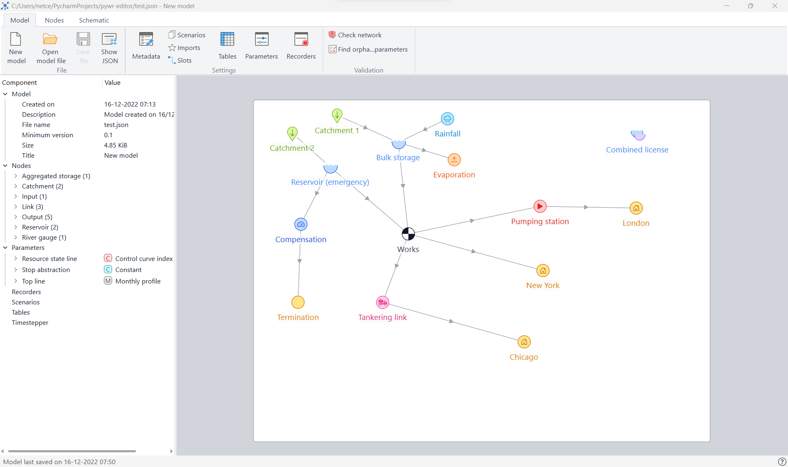
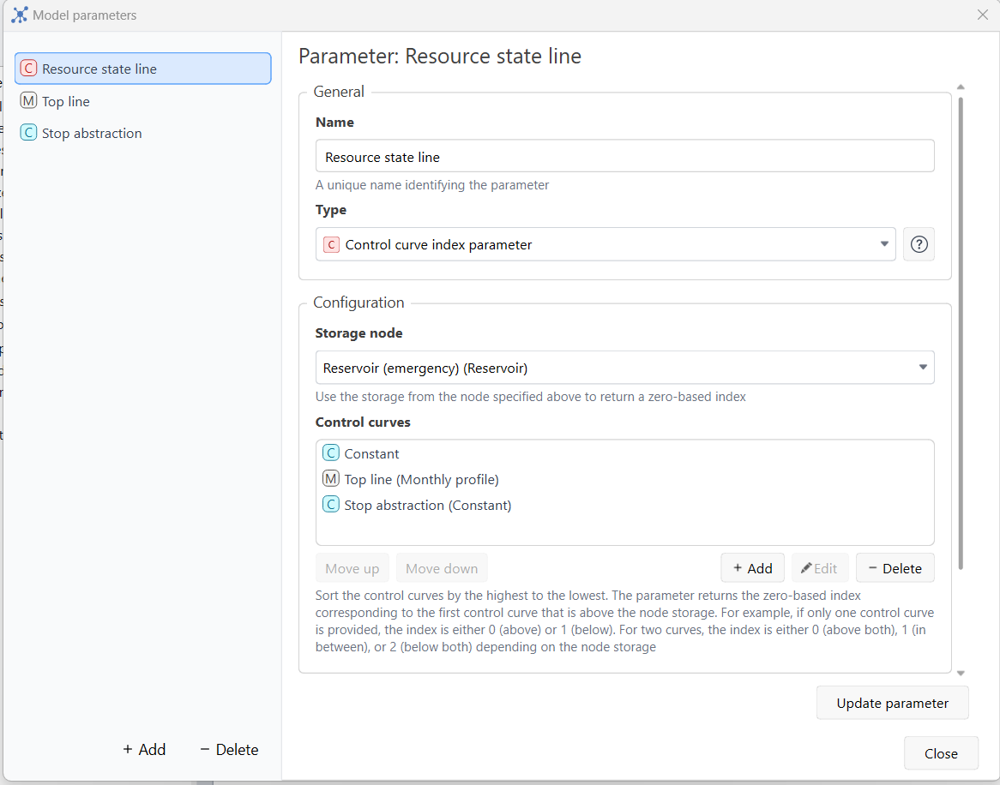
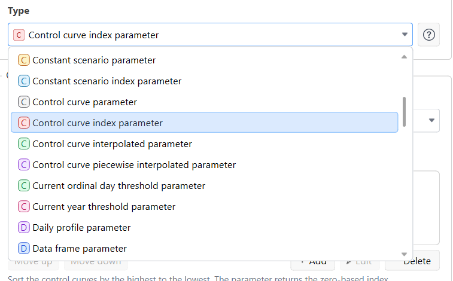
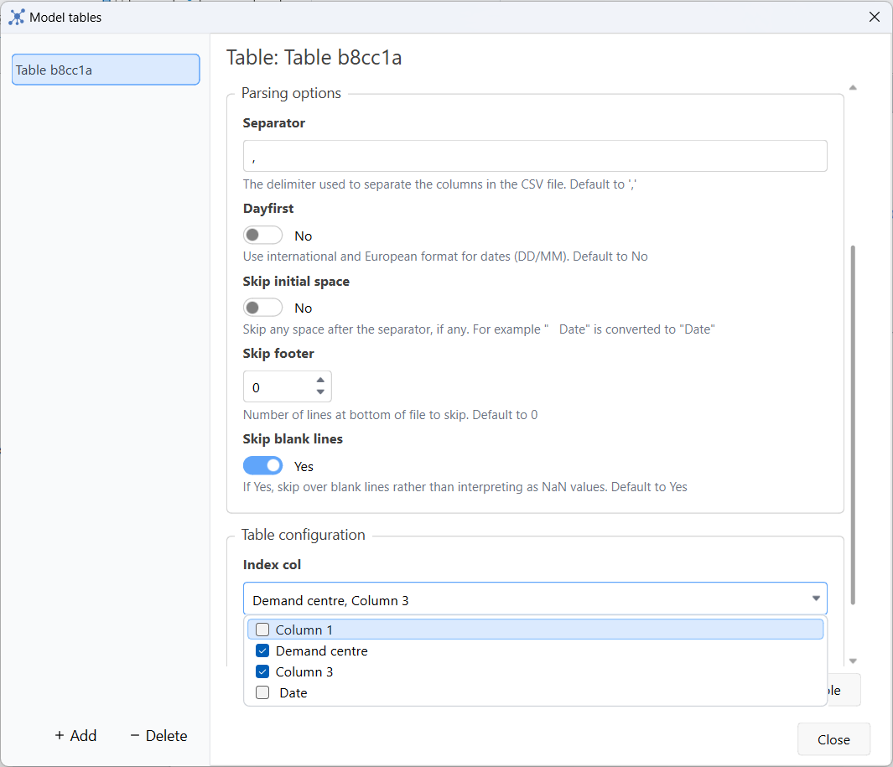
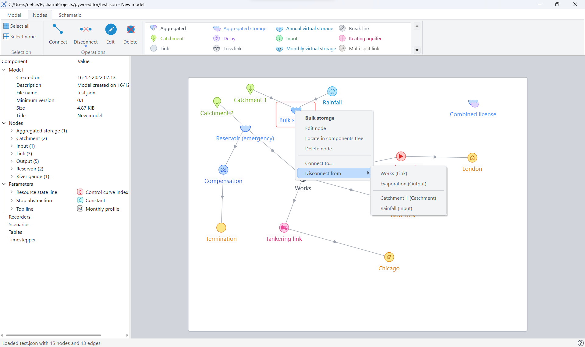
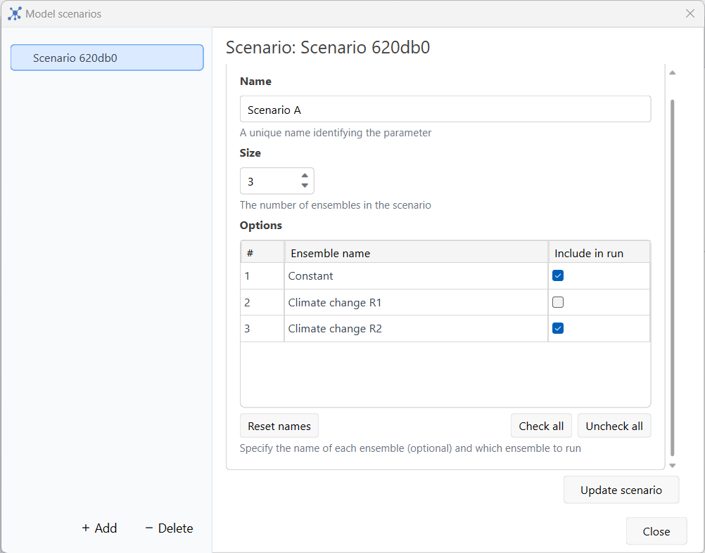
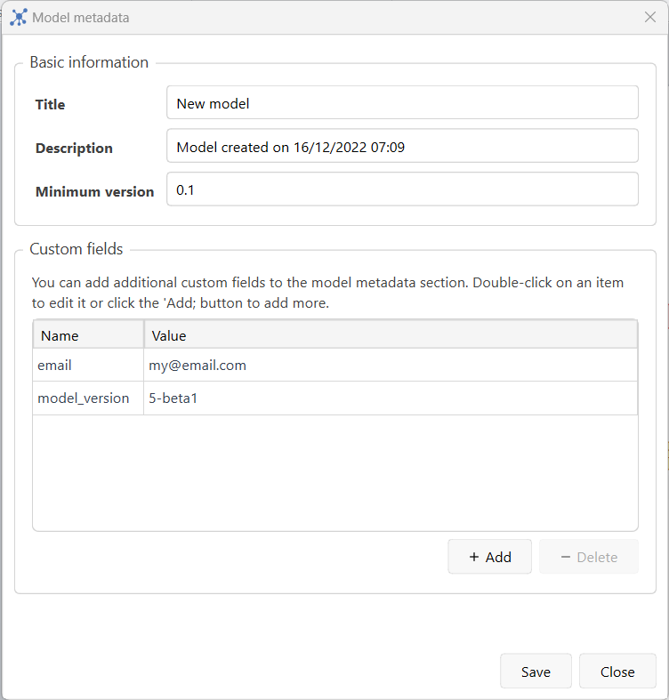
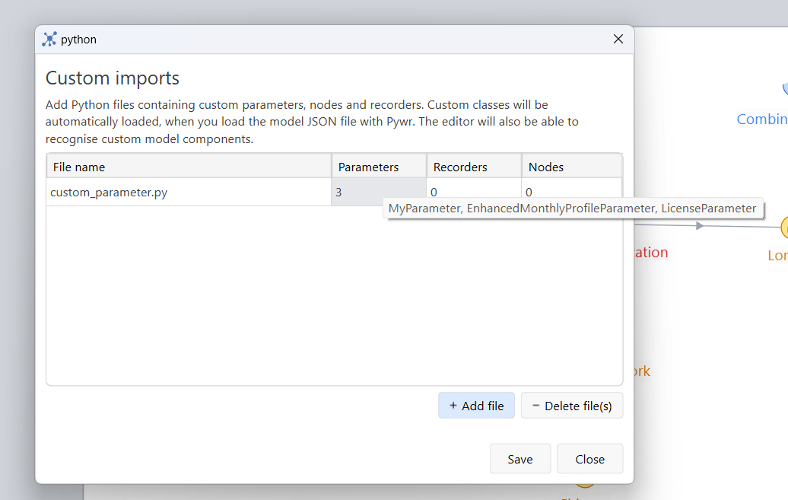

<h1 align="center">
  <br>
  
  <br>
  Pywr editor
  <br>
</h1>

<h4 align="center">A graphical user interface to edit Pywr models</h4>

<p align="center">
  <a href="https://www.gnu.org/licenses/gpl-3.0.en.html">
    
  </a>
  <a href="paypal.me/ssimoncelli87">
    
  </a>
  <a href="https://github.com/pywr-editor/editor/actions/workflows/build.yaml">
    
  </a>
  <a href="https://github.com/pywr-editor/editor/actions/workflows/test.yaml">
    
  </a>
  <a href="https://github.com/pywr-editor/editor/actions/workflows/flake8.yaml">
    
  </a>
</p>


Pywr editor is a user-friendly, free and open‑source graphical user interface (UI) to build and customise [pywr](https://github.com/pywr/pywr) 
models written in [JSON-based document](https://pywr.github.io/pywr/json.html) format. 

Pywr editor provides the following features:

- Full and easy customisation of model parameters, nodes, recorders, metadata, tables, imports and slots directly from the UI
- Dynamic validation of model configuration  
- Support of custom model components
- Interactive model schematic
  - pan, zoom, resize, screenshotting
  - drag, drop or delete multiple nodes at the same time
  - connect or disconnect nodes
  - change colour and shape of nodes
- External data support
  - Automatic parsing of external files to offer suggestions of DataFrame index and column names, and values (from CSV, Excel or HDF files)
  - Data visualisation with charts
  - Import/export value to Excel (Windows only)
- Windows integration
  - Open JSON files directly in the editor
  - Browse recent files
  - Pin most used models in the taskbar

> Note: although the software can run on any system that can run Python, 
> the editor is currently designed to work on Windows only. Upon request
> the UI can be optimised to work on Linux and Mac platforms.

# Screenshot gallery

<table cellspacing="0" cellpadding="0" border="0" align="center">
  <tr>
    <td><br/>Main window</td>
    <td><br/>Parameter dialog</td>
    <td><br/>Available parameters</td>
    <td><br/>Pandas parsing options with external data</td>
  </tr>
<tr>
    <td><br/>Node editing</td>
    <td><br/>Scenarios</td>
    <td><br/>Model metadata</td>
    <td><br/>Custom component import</td>
</tr>
</table>

# Getting started
You can get started with Pywr editor by installing the Windows binary or running the
repository source code.

## Install the executable
The Windows executable already bundles Python and all the necessary dependencies. You can either 
install the editor by downloading the [**Pywr editor installer.exe**](https://github.com/pywr-editor/editor/releases)
file in the [Release](https://github.com/pywr-editor/editor/releases) page of this project or by 
downloading and unpacking the [**Pywr editor.zip**](https://github.com/pywr-editor/editor/releases)
file with the Pywr editor.exe file.

## Run the Repository source code
You can run Pywr editor using the Python virtual environment on your machine. From your command line:

  ```bash
    # clone the repository first
    git clone https://github.com/pywr-editor/editor.git
    
    # create a new Python virtual environment
    python -m venv venv
    venv\Scripts\activate

    # install the necessary dependency first:
    pip install -r requirements.txt
    
    # run the editor using
    python main.py
  ```
this requires Python >= 3.10


# License
This software is licensed under the GNU General Public License, version 3.0+. See the [LICENSE](LICENSE.txt) file